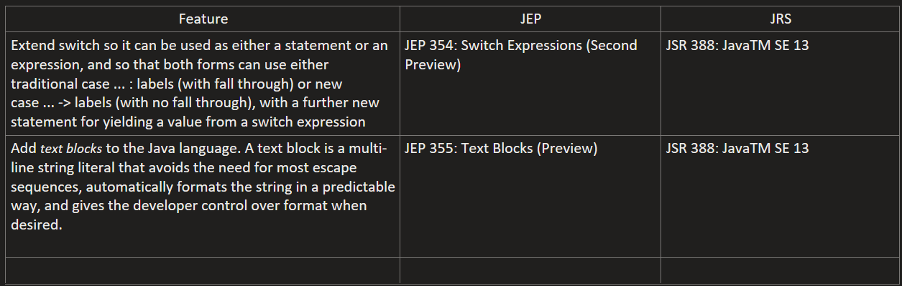

# java-13-features
## New Preview Features

## Settings in IntelliJ IDEA to use "Preview" features with Java 13
#### Settings > Build, Execution, Deployment > Compiler > Java Compiler :
- #### Project bytecode version: 13 
- #### Per-module bytecode version:
  - #### Module: java-13-features
  - #### Target bytecode version: 13
- #### Javac Options:
  - #### Additional command line parameters: --enable-preview
#### Run/Debug Configurations > Application > [Choose Application] :
- #### Build and Run > Modify Options > Add VM Options : 
  - #### VM Options: --enable-preview